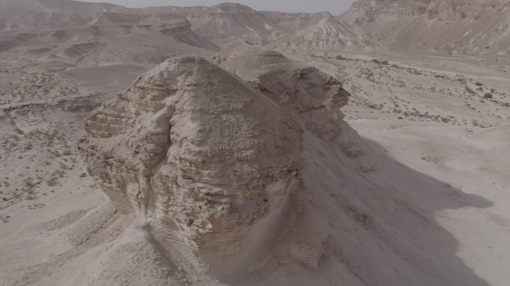
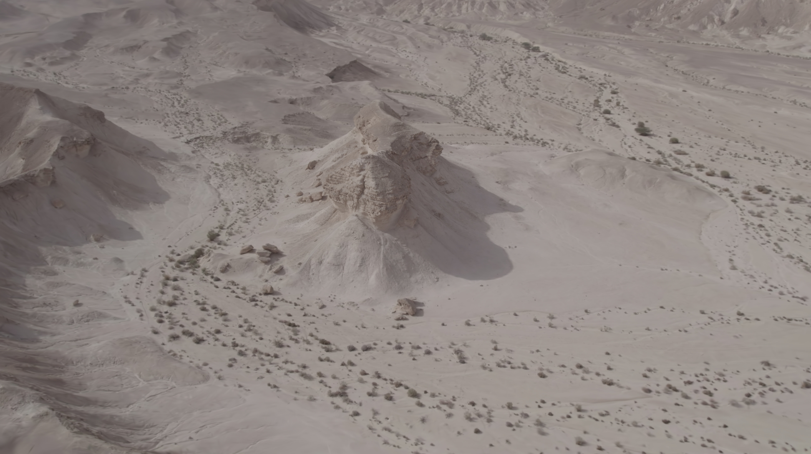

# Gaussian Splat Skill for Claude Code

A [Claude Code](https://claude.ai/code) skill that guides you through the full pipeline for creating Gaussian Splats from drone video — from raw footage to a `.ply` file ready for TouchDesigner or any 3DGS viewer.


*nerfstudio splatfacto-big render — aerial rock formation, 515K gaussians*

---

## What it does

Tell Claude **"create a gaussian splat from my drone video"** and the skill takes over:

- **Checks your environment** — asks for your install directory, runs `setup.py` to install everything missing (Python venv, PyTorch + CUDA, nerfstudio, COLMAP, ffmpeg)
- **Analyzes your footage** — reads sample frames, identifies scene type, recommends optimal training parameters
- **Guides each step** — color profile check, frame extraction, COLMAP, training, export
- **Fixes TouchDesigner artifacts** — creates a DC-only PLY to eliminate the SH coordinate mismatch that causes blue/green color fringing


*Aerial overview — same scene, nerfstudio interpolated camera path*

---

## Requirements

- Windows 11
- NVIDIA GPU (tested: RTX 4080 16GB)
- CUDA 12.4+
- Python 3.11 (`py` launcher)
- VS Build Tools 2022 (for gsplat CUDA JIT compilation)

The `setup.py` script installs everything else automatically.

---

## Installation

```bash
git clone https://github.com/lichtpfad/gaussian-splat-skill path/to/project/.claude/skills/create-gaussian-splat
```

Then in Claude Code:
> *"create a gaussian splat from my drone video"*

Claude will ask for your install directory and set up the environment on first run.

---

## Pipeline

| Step | What happens |
|------|-------------|
| **-1** | Environment check — asks for install path, runs `setup.py` if needed |
| **0** | Scene analysis — Claude reads sample frames, picks a preset |
| **1** | Color profile — checks `.SRT` file for D-Log M / Rec.709 |
| **2** | Frame extraction — `extract_frames.py` (`--fps` or `--count`) |
| **3** | COLMAP Structure-from-Motion via `ns-process-data` |
| **4** | Train `splatfacto-big` with tuned parameters |
| **5** | Export `.ply` via `ns-export gaussian-splat` |
| **6** | TouchDesigner prep — DC-only PLY via `create_dc_only.py` |

---

## Scene presets

Claude analyzes sample frames and selects from 7 presets:

| Scene | Key adjustments |
|-------|----------------|
| 🏔️ Aerial rock/desert ✓ | `bilateral_grid`, `scale_reg`, `stop_split_at=20K` |
| 🌳 Forest/vegetation | `stop_split_at=25K`, `max_iter=40K` |
| 🏙️ Aerial urban | `sh_degree=3`, `scale_reg` |
| 🏖️ Coastal/water | Reduced `num_frames`, `sh_degree=3` |
| ❄️ Snow/low-texture | `sh_degree=1`, `stop_split_at=15K` |
| 🏠 Ground exterior | `exhaustive` matching |
| 🏢 Interior | `exhaustive` matching, `scale_reg=False` |

---

## Key lessons learned

These insights come from real production use — things that aren't obvious from the docs:

- **COLMAP 3.9.1 only** — 3.13+ silently breaks nerfstudio 1.1.5's CLI interface
- **`--downscale-factor 2` is a subcommand** — must come after model params as `nerfstudio-data --downscale-factor 2`, not as a model flag
- **Nerfstudio viewer ≠ quality** — the viewer streams JPEG 75%; use `ns-render` or [SuperSplat](https://playcanvas.com/supersplat/editor) to evaluate real quality
- **SH fringing in TouchDesigner** — nerfstudio rotates the scene ~90° during training (`orientation_method='up'`), but this matrix isn't passed to the shader. DC-only PLY (`f_rest_*=0`) is the fix
- **`bilateral_grid=True`** is critical for drone footage — per-frame exposure compensation prevents shadow artifacts from different lighting angles
- **250 frames > 500 frames** — thinning from 499→246 frames improved quality by reducing redundant views that bias densification

---

## File structure

```
SKILL.md                      ← core pipeline instructions for Claude
scripts/
  setup.py                    ← full environment installer
references/
  scene-presets.md            ← diagnostic checklist + 7 scene presets
  pipeline-guide.md           ← complete command reference
assets/
  render_hero.jpg
  render_aerial.jpg
```

---

## Tested setup

```
nerfstudio 1.1.5
PyTorch 2.6.0+cu124
CUDA Toolkit 13.1
COLMAP 3.9.1
RTX 4080 16GB — ~16ms/iter, 35K iterations ≈ 9 minutes
```
